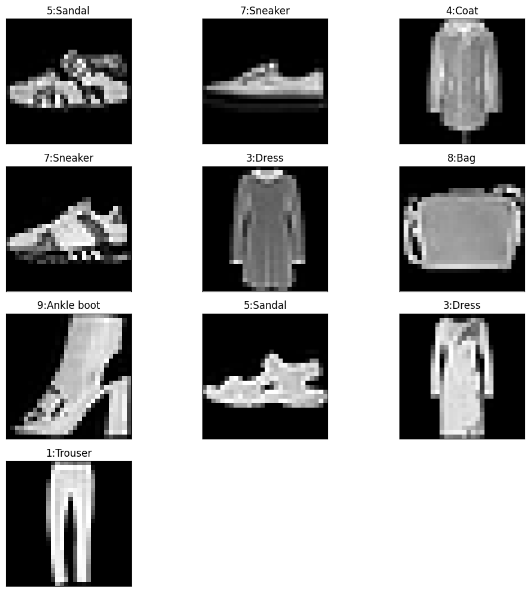
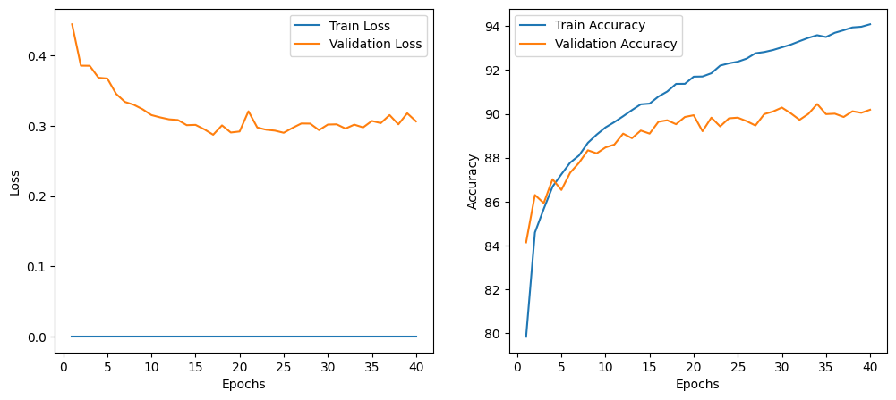
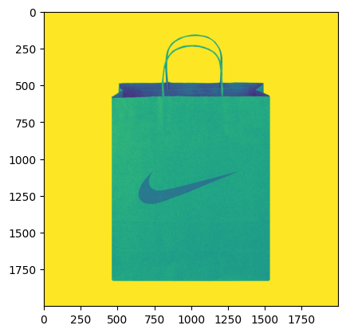
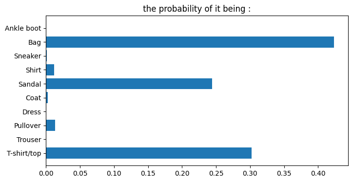
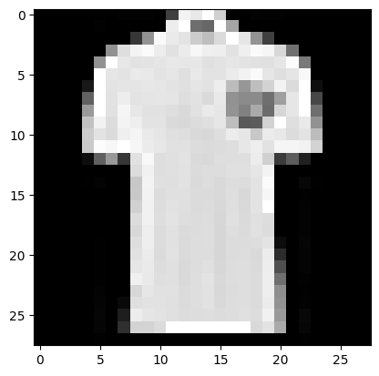

# Fashion MNIST Classification using PyTorch

This repository contains a PyTorch implementation of a Multi-Layer Perceptron (MLP) model to classify apparel based on the Fashion MNIST dataset.

## ✨ Features

* **Deep Learning Framework:** Built using PyTorch.
* **Architecture:** Custom MLP architecture featuring fully connected layers and Batch Normalization (`nn.BatchNorm1d`).
* **Optimization:** Trained using the Adam Optimizer and NLL Loss function.
* **Custom Image Testing:** Functionality to test the model with custom real-world images (e.g., custom T-shirt/apparel photos).
* **Visualizations:** Visualizes the dataset, model predictions, and test outputs directly within the notebook.

## 📊 Results and Visualizations

Below are some of the diagrams and outputs generated by the notebook during training and evaluation:

### Visualizations

**Fashion MNIST Dataset Samples**


**Training Metrics (Accuracy & Loss)**


**Custom Image Input (Bag)**

  
**MLP Prediction Output**


**Tensor Representation (What the Model Sees)**


## 🚀 How to Run

1. Clone the repository to your local machine:
   ```bash
   git clone <your-repository-url>
   ```
2. Open the `project.ipynb` in Google Colab, Jupyter Notebook, or VS Code.
3. Install the required dependencies (if running locally):
   ```bash
   pip install torch torchvision torchinfo matplotlib numpy
   ```
4. Run the notebook sequentially. You can also mount Google Drive to save/load the trained `.pth` model as shown in the notebook.

## 📂 Project Structure

- `project.ipynb`: Main notebook containing the PyTorch model, training loop, evaluation metrics, and visualization code.
- `images/`: Directory containing extracted outputs and prediction visual samples from the notebook.

---
_Generated for Fashion MNIST experimentation._
